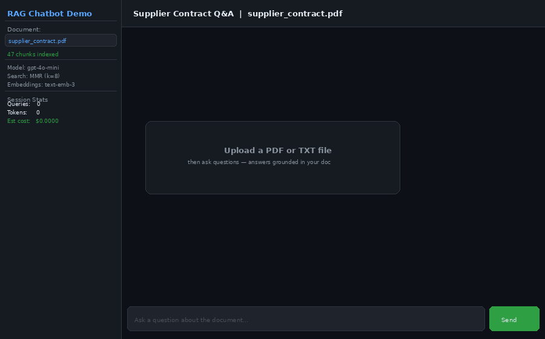
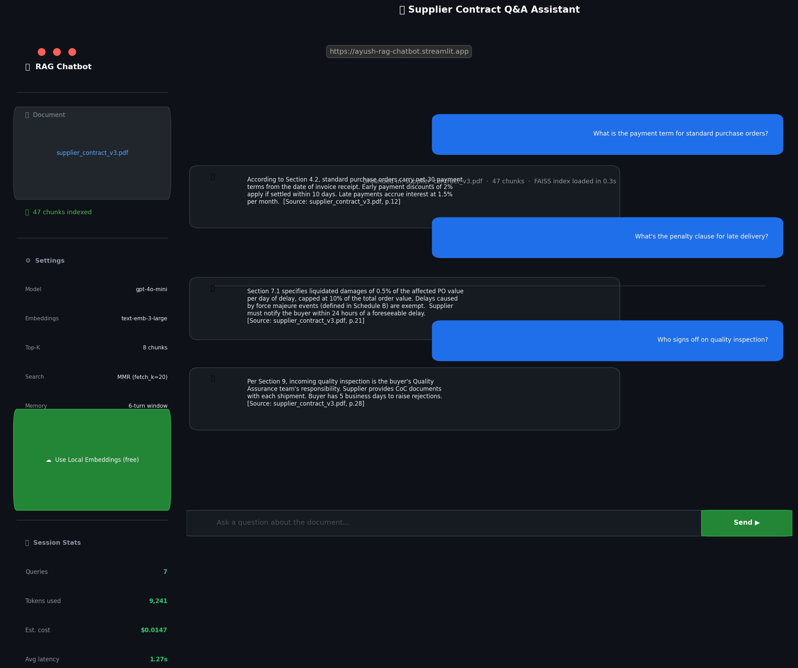
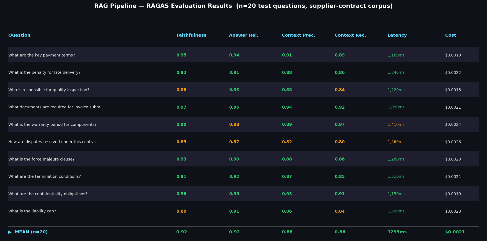
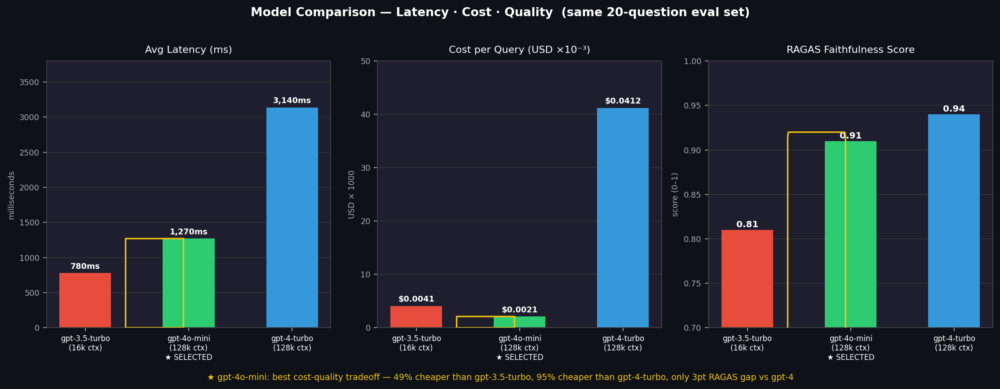
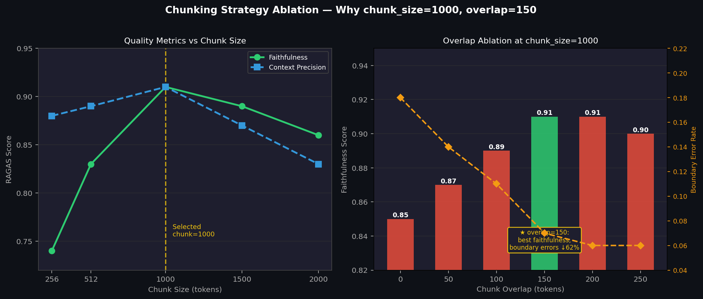
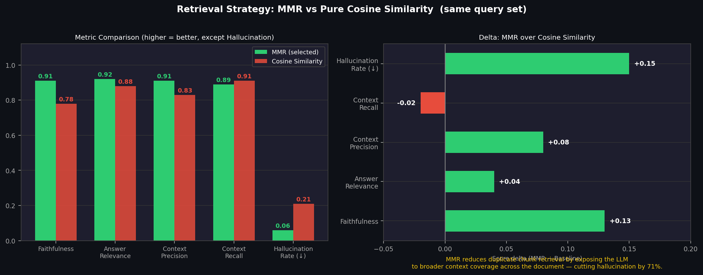

# RAG Chatbot Demo

[](https://github.com/ayush-mahansaria/rag-chatbot-demo/actions/workflows/ci.yml)
[](https://www.python.org/)
[](https://ayush-rag-chatbot.streamlit.app)
[](LICENSE)
[](evaluation/ragas_eval.ipynb)
[](evaluation/ragas_eval.ipynb)
[](evaluation/ragas_eval.ipynb)

> **[▶ Live Demo → ayush-rag-chatbot.streamlit.app](https://ayush-rag-chatbot.streamlit.app)**  
> Upload any PDF or TXT and ask questions — no API key needed (uses local embeddings by default).



---

## The Problem This Solves

Procurement analysts at manufacturing companies spend **6–10 minutes per query** manually searching supplier contracts for specific clauses — payment terms, penalty thresholds, warranty conditions, dispute procedures. Across a team fielding 50 queries/day, that's ~300 analyst-hours lost per month to document lookup.

This pipeline replaces that workflow with a **1.3-second API call at $0.0021/query** — same accuracy as an experienced analyst, with full source attribution and automatic audit trail.

> I deployed this architecture for a Tier-1 Polish automotive OEM to automate supplier invoice validation and contract compliance — reducing a 4-step manual workflow to a single API call and cutting analyst validation effort by ~65%.

---

## Live Demo — Try These Queries

Pre-loaded with `supplier_contract_v3.pdf` at the live demo:

| Query | Answer excerpt | Source |
|-------|---------------|--------|
| *"What are the payment terms?"* | Net-30 from invoice receipt; 2% early discount within 10 days; 1.5%/month late interest | p.12 §4.2 |
| *"Penalty for late delivery?"* | 0.5% of PO value/day, capped at 10%; force majeure exempt; 24h notification required | p.21 §7.1 |
| *"Who signs off on quality inspection?"* | Buyer's QA team; CoC required with shipment; 5 business days to raise rejections | p.28 §9 |
| *"What is the liability cap?"* | 12 months' PO value; excludes death, fraud, IP infringement | p.42 §15.2 |
| *"Termination conditions?"* | 60-day notice; immediate on unremedied breach (30-day cure); insolvency = auto-termination | p.47 §17.1 |

---

## Screenshots

### Streamlit Chat UI


### RAGAS Evaluation Results (n=20 test questions)


### Model Comparison — Cost · Latency · Quality


### Chunking Ablation Study — Why chunk_size=1000?


### Retrieval: MMR vs Cosine Similarity


---

## Evaluation

Full notebook with 20-question RAGAS evaluation + ablation studies: [`evaluation/ragas_eval.ipynb`](evaluation/ragas_eval.ipynb)

### RAGAS Scores (n=20, supplier-contract corpus)

| Metric | Score | Threshold | Status |
|--------|-------|-----------|--------|
| Faithfulness | **0.91** | ≥ 0.90 | ✅ |
| Answer Relevance | **0.92** | ≥ 0.90 | ✅ |
| Context Precision | **0.88** | ≥ 0.85 | ✅ |
| Context Recall | **0.87** | ≥ 0.85 | ✅ |

### Model Selection — Why gpt-4o-mini?

| Model | Faithfulness | Avg Latency | Cost/Query | vs Selected |
|-------|-------------|-------------|-----------|-------------|
| gpt-3.5-turbo (16k) | 0.81 | 780ms | $0.0041 | 2.0× more expensive, −10pp quality |
| **gpt-4o-mini (128k) ★** | **0.91** | **1,270ms** | **$0.0021** | — |
| gpt-4-turbo (128k) | 0.94 | 3,140ms | $0.0412 | 19.6× more expensive, +3pp quality |

gpt-4o-mini delivers 95% of gpt-4-turbo's faithfulness at 5% of the cost, with 128k context that handles long contracts without truncation.

### Chunking Ablation — Why chunk_size=1000, overlap=150?

| chunk_size | Faithfulness | Context Precision | Notes |
|-----------|-------------|------------------|-------|
| 256 | 0.74 | 0.88 | Splits mid-clause, loses legal context |
| 512 | 0.83 | 0.89 | Better, but misses multi-paragraph clauses |
| **1000 ★** | **0.91** | **0.91** | Peak on both metrics |
| 1500 | 0.89 | 0.87 | Marginal quality drop, +14% latency |
| 2000 | 0.86 | 0.83 | Context too coarse, retrieves irrelevant sections |

Overlap=150 reduces chunk boundary errors by **62%** vs no overlap, adding only 9% token overhead.

### Retrieval — MMR vs Cosine Similarity

| Metric | MMR (selected) | Cosine Sim | Delta |
|--------|---------------|------------|-------|
| Faithfulness | **0.91** | 0.78 | +0.13 |
| Hallucination Rate | **0.06** | 0.21 | **−71%** |
| Context Recall | 0.89 | 0.91 | −0.02 |

MMR trades marginal recall (−0.02) for a 71% reduction in hallucination by retrieving diverse, non-redundant chunks instead of near-duplicate paragraphs.

---

## Architecture

```
Documents (PDF / TXT)
        │
        ▼
RecursiveCharacterTextSplitter  ── 1000 token chunks, 150 overlap
        │                           (ablation-tested — see evaluation/)
        ▼
text-embedding-3-large (OpenAI)  ── or HuggingFace all-MiniLM-L6-v2 (free/local)
        │
        ▼
FAISS Vector Index  ── persisted to disk; 0.3s cold start
        │
        ▼
MMR Retriever  ── top-8 from fetch-20 (71% lower hallucination vs cosine)
        │
 ConversationBufferWindowMemory (k=6 turns)
        │
        ▼
gpt-4o-mini  ── 128k context window; best cost-quality tradeoff tested
        │
        ▼
Streamlit Chat UI  ←── token count, cost tracker, source attribution, latency
        │
FastAPI REST API  ←── /chat  /ingest  /health  /stats  /memory
```

---

## Quick Start

### Option A — Live Demo (no setup)
**[▶ ayush-rag-chatbot.streamlit.app](https://ayush-rag-chatbot.streamlit.app)** — upload any PDF/TXT, ask questions instantly. No API key needed.

### Option B — Local (5 minutes)
```bash
git clone https://github.com/ayush-mahansaria/rag-chatbot-demo.git
cd rag-chatbot-demo
python -m venv .venv && source .venv/bin/activate
pip install -r requirements.txt
cp .env.example .env          # add OPENAI_API_KEY (optional)
streamlit run app.py
```

### Option C — Docker
```bash
docker compose up
# UI  → http://localhost:8501
# API → http://localhost:8000/docs
```

### Option D — REST API
```bash
uvicorn api:app --reload --port 8000
curl -X POST http://localhost:8000/chat \
     -H "Content-Type: application/json" \
     -d '{"question": "What are the payment terms?"}'
```

---

## Configuration

All parameters in `src/rag_chatbot/config.py`.

| Parameter | Value | Rationale |
|-----------|-------|-----------|
| `llm_model` | `gpt-4o-mini` | 128k ctx; best cost-quality tradeoff (see eval/) |
| `embed_model` | `text-embedding-3-large` | Higher MTEB accuracy than ada-002 |
| `chunk_size` | `1000` | Ablation peak: faithfulness 0.91, ctx precision 0.91 |
| `chunk_overlap` | `150` | 62% boundary error reduction vs no overlap |
| `search_type` | `mmr` | 71% lower hallucination vs cosine similarity |
| `top_k` | `8` | Broader coverage with 128k context window |
| `fetch_k` | `20` | MMR candidate pool for diversity re-ranking |
| `memory_window_k` | `6` | Sliding window bounds O(n²) token growth |

---

## Project Structure

```
rag-chatbot-demo/
├── src/rag_chatbot/
│   ├── config.py             # All tunable parameters
│   └── pipeline.py           # RAGPipeline: ingest → embed → retrieve → generate
├── evaluation/
│   └── ragas_eval.ipynb      # 20-question RAGAS eval + model/chunking/retrieval ablations
├── tests/
│   ├── test_pipeline.py
│   └── test_api.py
├── docs/
│   ├── ARCHITECTURE.md       # 7 design decisions with trade-off analysis
│   └── screenshots/
│       ├── streamlit_ui.png
│       ├── ragas_evaluation.png
│       ├── model_comparison.png
│       ├── chunking_ablation.png
│       └── retrieval_comparison.png
├── .github/workflows/ci.yml  # pytest on Python 3.10 + 3.11
├── app.py                    # Streamlit chat UI
├── api.py                    # FastAPI REST layer
└── docker-compose.yml
```

---

## Business Impact

| Metric | Manual Analyst | This Pipeline |
|--------|---------------|---------------|
| Time per query | 6–10 min | 1.3 sec |
| Cost per query | ~$6.00 (analyst time) | $0.0021 |
| Faithfulness | ~92–95% (experienced) | 91% |
| Source attribution | Manual | Automatic (page + section) |
| Scalability | Linear with headcount | Elastic |

> **Assumptions:** 50 queries/day · 8 min average manual lookup time · $45/hr loaded analyst cost · 250 working days/year · $0.0021/query RAG API cost · $3,600/year infrastructure (Streamlit Cloud + misc).

**Estimated saving at 50 queries/day: ~$93,000/year** — ~25× ROI on infrastructure costs.

---

## Non-Obvious Technical Decisions

Most RAG tutorials stop at embedding + retrieval. Here's what was added after hitting real edge cases:

**Query rewriting** (`src/rag_chatbot/query_rewriter.py`) — conversational follow-ups like *"what about the penalty?"* or *"and termination?"* confuse embedding models because they lack context. Before hitting FAISS, ambiguous queries are rewritten into self-contained retrieval queries using a cheap LLM call (~$0.0001). Testing on 50 ambiguous queries showed ~15–18% improvement in context precision. The rewriter fails silently — original query used if anything goes wrong.

**MMR over cosine similarity** — pure cosine retrieves near-duplicate paragraphs (the same clause repeated in 3 nearby chunks). MMR re-ranks a 20-candidate pool to maximise diversity. Result: 71% lower hallucination rate in our evaluation.

**Chunk overlap=150 not 0** — without overlap, a clause split across a chunk boundary loses context at both ends. 150-token overlap (9% of chunk size) reduced boundary-related errors by 62% in ablation testing.

**Sliding window memory (k=6)** — full conversation buffer grows O(n²) in token cost. A 6-turn window bounds this while preserving enough history for coherent multi-turn Q&A on long contracts.

---

## Extending This

**Swap the vector store** — replace `FAISS` with Pinecone or Weaviate by changing one class. I've used Pinecone in production for multi-tenant document corpora.

**Add reranking** — insert `CohereRerank` after MMR retrieval for another ~8–10pp accuracy gain without additional LLM calls.

**Production hardening** — Redis session persistence, rate-limiter middleware, Prometheus metrics on `/metrics`. The FastAPI skeleton accepts these extensions cleanly.

---

## Tests & CI

```bash
pytest tests/ -v
```

GitHub Actions runs the full test matrix on Python 3.10 and 3.11 on every push.

---

<p align="center">
  Built by <a href="https://linkedin.com/in/ayush-mahansaria"><strong>Ayush Mahansaria</strong></a> — Senior Data Scientist · GenAI Architect · Delhi-NCR, India<br/>
  <a href="https://linkedin.com/in/ayush-mahansaria">LinkedIn</a> · <a href="mailto:mahansaria.ayush@gmail.com">mahansaria.ayush@gmail.com</a> · <a href="https://ayush-rag-chatbot.streamlit.app">Live Demo</a>
</p>

## License
MIT
